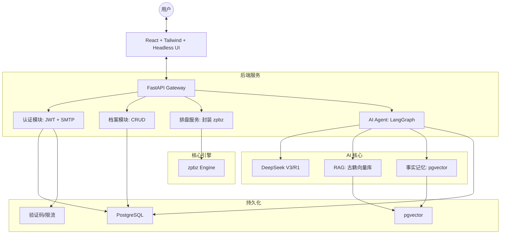
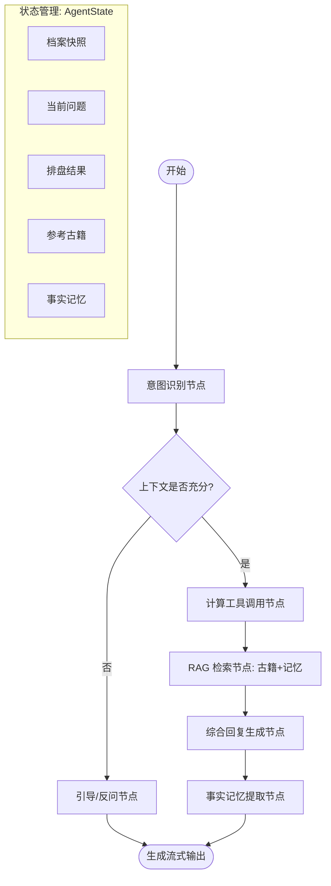

# 子平真君 AI 命理分析应用执行计划 (API First + TDD)

## 1. 任务目标
构建一个结合高精度命理引擎（zpbz）与 AI Agent（LangGraph）的专业命理 Web 应用：
- **核心逻辑**：计算（zpbz）与分析（LLM）严格分离。
- **AI 能力**：具备古籍 RAG、长期事实记忆及实时时间感知。
- **用户体验**：响应式布局、流式对话、交互式排盘钻取。

## 2. 系统架构设计


## 3. 详细设计

### 3.1 目录结构
```text
zpzj/
├── backend/                # FastAPI 后端项目根目录
│   ├── app/
│   │   ├── api/            # 接口层
│   │   │   └── v1/         # 版本化路由 (auth.py, archive.py, chat.py)
│   │   ├── core/           # 核心配置 (config.py, security.py, mail.py)
│   │   ├── db/             # 数据库层 (session.py, base.py)
│   │   ├── models/         # SQLModel 数据库模型定义
│   │   ├── schemas/        # Pydantic 数据传输对象 (DTO)
│   │   ├── services/       # 业务逻辑层 (bazi_service.py, archive_service.py)
│   │   ├── agent/          # LangGraph Agent 核心逻辑
│   │   │   ├── nodes/      # 节点定义 (intent.py, calculate.py, rag.py)
│   │   │   ├── state.py    # Agent 状态定义
│   │   │   └── tools/      # Agent 外部工具 (bazi_tool.py, memory_tool.py)
│   │   └── main.py         # 应用入口点
│   ├── tests/              # 测试目录 (单元测试与集成测试)
│   ├── scripts/            # 工具脚本 (古籍向量化、初始化数据)
│   ├── alembic/            # 数据库迁移脚本
│   ├── requirements.txt
│   └── .env.example
├── frontend/               # React 前端项目根目录
│   ├── src/
│   │   ├── api/            # Axios/Fetch 封装
│   │   ├── components/     # 通用 UI 组件 (Headless UI)
│   │   ├── features/       # 业务功能模块
│   │   │   ├── auth/       # 登录/验证
│   │   │   ├── bazi/       # 排盘渲染与交互
│   │   │   ├── chat/       # 聊天窗口与流式处理
│   │   │   └── profile/    # 档案与设置
│   │   ├── hooks/          # 自定义 React Hooks
│   │   ├── store/          # 状态管理 (Zustand)
│   │   └── App.tsx
│   ├── tailwind.config.js
│   └── package.json
└── zpbz/                   # 本地核心命理引擎 (Submodule)
```

### 3.2 LangGraph 工作流编排流程


### 3.3 关键 API 设计 (API First 规范)
- `POST /api/v1/auth/send-code`: 发送邮箱验证码
- `POST /api/v1/auth/login`: 验证并登录
- `GET/POST /api/v1/archives`: 档案列表与创建
- `GET/PATCH/DELETE /api/v1/archives/{id}`: 档案详情、部分更新与删除
- `GET /api/v1/bazi/chart/{archive_id}`: 获取核心排盘数据
- `POST /api/v1/chat/completions`: 流式咨询接口 (SSE)
- `DELETE /api/v1/chat/facts/{fact_id}`: 删除特定事实记忆

### 3.4 数据库模型 (字段明细)
- **User**: `id, email, hashed_password, nickname, avatar_url, settings(depth, response_mode)`
- **Archive**: `id, user_id, name, gender, birth_time, calendar_type, lat, lng, location_name, is_self, relation, algorithms_config(json)`
- **ChatSession**: `id, user_id, archive_id, title, last_summary`
- **Message**: `id, session_id, role, content, metadata(citations, bazi_snapshot)`
- **MemoryFact**: `id, archive_id, content, vector`

## 4. 阶段任务规划 (明细版)

### 阶段 1：基础设施、认证与安全 (T1-T2)
- **1.1 环境搭建**：FastAPI + pgvector + Redis 容器化，配置 SQLModel 与 Alembic。
- **1.2 认证系统**：实现 SMTP 验证码流、Redis 限流与 JWT 权限控制。
- **1.3 个人设置**：支持持久化存储对话深度及回答模式（普通/专业）。

### 阶段 2：档案管理与命理引擎集成 (T3-T4)
- **2.1 档案 CRUD**：增加 `relation` 字段，实现出生地经纬度高精度解析。
- **2.2 引擎封装**：确保 API 输出包含**纳音、旬空、旺相休囚死、三元**等全量专业命理数据。
- **2.3 配置实时生效**：实现会话对档案配置变更的毫秒级感知。

### 阶段 3：AI Agent 核心、RAG 与记忆 (T5-T7)
- **3.1 知识库与性能优化**：向量化古籍，实施 **Prompt Caching** 优化。
- **3.2 LangGraph 工作流编排**：实现 3.2 节定义的流程，包含交互式诊断逻辑。
- **3.3 记忆系统**：实现长期事实抽取与删除管理。

### 阶段 4：前端 UI 实现与前后端联调 (T8-T10)
- **4.1 排盘可视化**：实现专业排盘 UI（核心区、能量区、运程区钻取）。
- **4.2 AI 咨询流**：支持 SSE 流式渲染、Markdown 脚注引用。
- **4.3 档案与设置管理**：实现档案管理详情页及“事实记忆”管理清单。

## 5. 执行规范
- **API First**: 必须先定义 Pydantic 模型再写业务。
- **TDD**: 整体测试覆盖率要求 > 80%。
- **DRY & 解耦**: 采用依赖注入与 Feature-based 架构。
- **RAG 规范**: 专业模式必带引用，普通模式侧重心理疏导。

## 6. 测试验收标准
- **单元测试**：覆盖所有 Service 层函数。
- **集成测试**：模拟“引导反问 -> 补充背景 -> 正确计算 -> 生成回复”闭环。
- **回归测试**：CI 自动化拦截 Prompt 质量下降。
- **性能指标**：首字响应 < 2.5s，排盘数据 100% 准确。
